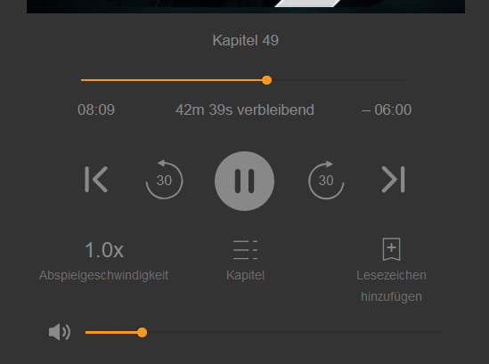

# Customize Audible Cloud Player

Change the Audible Cloud Player to:
- Dark Skin
- Add Volume Control 
   - based on code from https://github.com/peterphmikkelsen/audible-volume-control
   - remembers volume settings.

Sample Image:

## Installation

1. First you need a Browser Extension for managing UserScripts (skip if you already have one):  
   * Chrome: [Violentmonkey](https://chrome.google.com/webstore/detail/violentmonkey/jinjaccalgkegednnccohejagnlnfdag) or [Tampermonkey](https://chrome.google.com/webstore/detail/tampermonkey/dhdgffkkebhmkfjojejmpbldmpobfkfo)
   * Firefox: [Violentmonkey](https://addons.mozilla.org/en-US/firefox/addon/violentmonkey/), [Tampermonkey](https://addons.mozilla.org/en-US/firefox/addon/tampermonkey/) or [Greasemonkey](https://addons.mozilla.org/en-US/firefox/addon/greasemonkey/) 
   * Opera: [Tampermonkey](https://addons.opera.com/en/extensions/details/tampermonkey-beta/)
   * Brave: [Violentmonkey](https://chrome.google.com/webstore/detail/violentmonkey/jinjaccalgkegednnccohejagnlnfdag) or [Tampermonkey](https://chrome.google.com/webstore/detail/tampermonkey/dhdgffkkebhmkfjojejmpbldmpobfkfo)
   * Edge: [Violentmonkey](https://microsoftedge.microsoft.com/addons/detail/violentmonkey/eeagobfjdenkkddmbclomhiblgggliao) or [Tampermonkey](https://microsoftedge.microsoft.com/addons/detail/tampermonkey/iikmkjmpaadaobahmlepeloendndfphd)  
    
2. Install script from [it's page](https://raw.githubusercontent.com/waringer/CustomAudiblePlayer/main/CustomAudiblePlayer.user.js)
